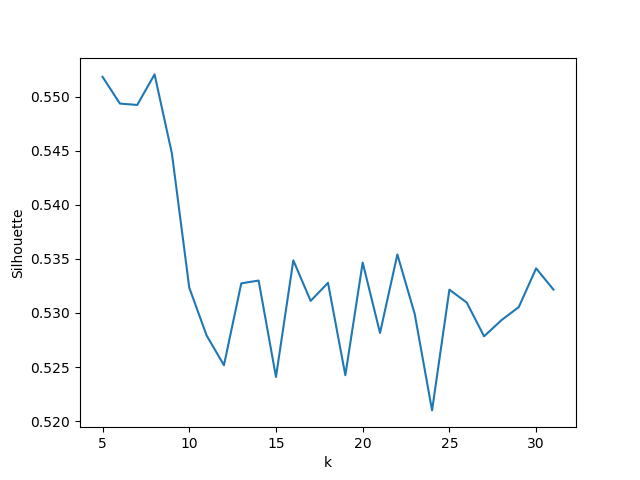
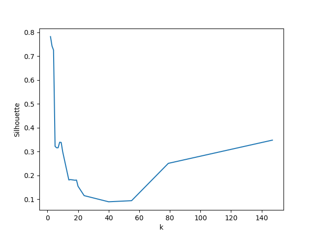

# 说明

### 代码说明
1. 运行`generate_track_matrix.py`, 获得0-1矩阵经pca处理后初始数据`track_matrix.txt`.

2. Q1: k-means
  2.1 运行`k_means.py`, 获得最优的k和对应的label, 输出到`k_means_res.txt`;
  2.2 运行`print_map.py`, 投影到百度地图进行可视化.

3. Q2: DBSCAN
  3.1 运行`dbscan.py`, 获得最优的k和对应的label, 输出到`dbscan_res.txt`;
  3.2 修改`print_map.py`:
  ```py
  res_file = open("k_means_res.txt", "r")
  #res_file = open("dbscan_res.txt", "r")

  GEN_HTML = "k_means.html"
  #GEN_HTML = "dbscan.html"
  ```
  为:
  ```py
  #res_file = open("k_means_res.txt", "r")
  res_file = open("dbscan_res.txt", "r")

  #GEN_HTML = "k_means.html"
  GEN_HTML = "dbscan.html"
  ```
  后运行, 投影到百度地图进行可视化.

4. Q3: GMM
运行`gmm.py`即可输出结果.

### 讨论
**比较DBScan和k-means二者的最优聚类结果，并加以讨论和比较.**
1. 首先, 无论是k-means还是DBSCAN, 均出现了过拟合的情况, 即当k值接近1的时候, Silhouette系数出现不正常的偏高.为了解决该情况, 在研究了结果的Silhouette-k图后, 对k的最小值进行了限制, 取得了最佳值.

2. DBSCAN的最佳k值是**4**, k-means则是**8**, 对比两者结果在百度地图上的投影图则可以发现, DBSCAN的聚类结果集中在第一类, 而k-means分布较均衡. 在本案例中, k-means的结果要好于DBSCAN. 由于pca降维较多, 最终计算的数据量并不是很大, 因此无法对比两种算法的计算效率.

3. 对比DBSCAN和k-means的Silhouette-k图可知k-means在2 - 9范围内的Silhouette参数较高, 且整体波动性较大; 而DBSCAN排除掉离群值在较大k值的影响, 实际上是在 2 - 10的范围内有一个锐减的过程, 然后保持在较低的水平.
k-means图:

DBSCAN图:


4. 参考第三问的结果: 分别根据k-means和DBSCAN的最佳k值设定GMM的n_components, 并假定聚类结果为真实的聚类结果, 设定 `random_state=10`(为了保证arruracy稳定) 计算GMM的准确率, 结果为:
```
GMM vs k-means accuracy: 95.9
GMM vs DBSCAN accuracy: 71.8
```
此外, 还可以发现k-means的结果会随着random_state值变动而上下变动, 范围约为70% ~ 96%; 而DBSCAN则始终保持在72%上下.

5. 最终结果到图上均不是很好, 一方面我们可以看到数据并没有呈现非常显著的簇状; 另一方面, 可能是因为pca降维降过了.
